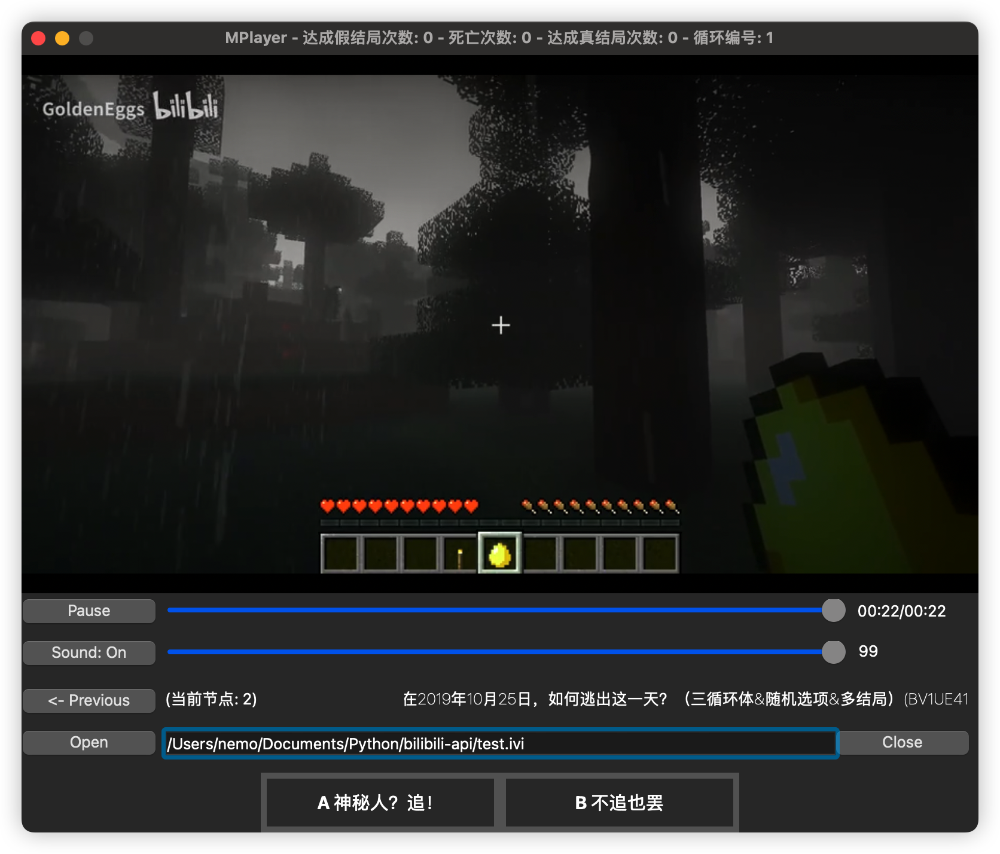

<div align="center">

# **MPlayer** - A Bilibili Interactive Video Player

**⚠️⚠️⚠️FBI Warning: **💩code**⚠️⚠️⚠️**

</div>

这个播放器只不过是为了播放 bilibili_api 下载下来的 IVI 互动视频文件而写的，因此更注重于互动视频的逻辑，而不是播放器基础功能，更不会整什么花里胡哨的外观。

## 功能介绍

通过 MPlayer，你能在离线状态下通过 `ivi` 文件来玩互动视频。`MPlayer` 支持互动视频的跳转、变量、跳转概率等概念，能~~完全~~还原互动视频体验。在基础的视频播放上面，`MPlayer` 还原了进度条、音量控制。

## ScreenShot



1. 主题画面显示在窗口中间。
2. 下面两个拖动条用来控制播放进度和音量。
3. 再下面是文件相关操作。
4. 因各种原因，跳转按钮放到了最下面。
5. 变量因不可抗因素，被安排在了标题栏。
6. 就说是 **💩code**

## 原理介绍

本项目使用 Python**3.11**(内含 python**3.10** `match-case` 最新语法)，基于 PyQt**6** 开发，许多地方与 PyQt**5** 不兼容，因此你需要另外安装 PyQt**6**。

## Run

```
pip3 install -r requirements.txt // 依赖：PyQt6, bilibili-api-python>=14.0.0.a3
python3 MPlayer.py
```

## 测试通过平台

| name | version | py_version | note |
| ---- | ------- | ---------- | ---- |
| Windows | 11 (21H2) | 3.11.0 | (EMPTY) |
| MacOS | 13.1 | 3.11.1 | (EMPTY) |
