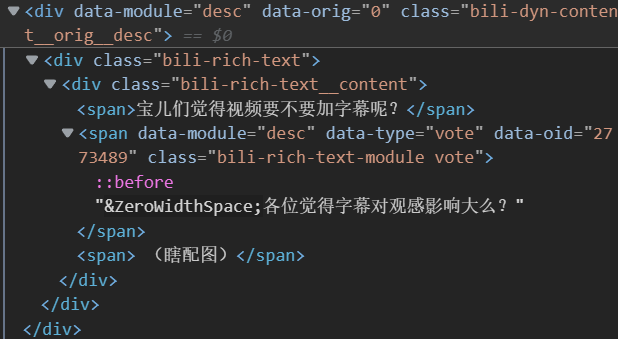

# 获取 vote_id

在操作投票时，需要 vote_id，有两种获取方式：

## 1. 爬取动态获取
举例：一下是一个动态:
``` python
{
    ...
    "extension": {
        "vote_cfg": {"vote_id": 2773489, "desc": "各位觉得字幕对观感影响大么？", "join_num": 1219},
        "vote": '{"choice_cnt":1,"default_share":1,"default_text":"","desc":"各位觉得字幕对观感影响大么？","endtime":1654678098,"join_num":1219,"options":[{"btn_str":"","desc":"加字幕吧，观众看着方便些！","idx":1,"title":""},{"btn_str":"","desc":"不用字幕，长视频加起来麻烦，而且有点挡","idx":2,"title":""}],"status":4,"type":0,"uid":471723540,"vote_id":2773489}',
    },
    "extend_json": {
        ...
        "vote": {
            "choice_cnt": 1,
            "default_share": 1,
            "default_text": "",
            "desc": "各位觉得字幕对观感影响大么？",
            "endtime": 1654678098,
            "join_num": 1219,
            "options": [
                {"btn_str": "", "desc": "加字幕吧，观众看着方便些！", "idx": 1, "title": ""},
                {"btn_str": "", "desc": "不用字幕，长视频加起来麻烦，而且有点挡", "idx": 2, "title": ""},
            ],
            "status": 4,
            "type": 0,
            "uid": 471723540,
            "vote_id": 2773489,
        },
    },
    ...
}
```

我们能发现，这里有`vote_id`字段，值为 `2773489`。

## 2.网页源代码

**需要已经用 javascript 加载好的页面查询**

1. 按 **F12** 打开开发者工具。

2. 选择 div，放到 div 标签上，浏览器会高亮对应的区域，只要区域在有投票的动态中，就打开 div，继续选择，直到没有 div 为止。



3. 大家可以看到一个 span 片段：

``` html
<span data=module="desc" data-type="vote" data-oid="2773489" class="bili-rich-text-module vote">
    ...
</span>
```

很明显，这就是投票入口片段（看 `data-type`）我们能看到这个片段有一个属性：data-oid，没错这个值就是 vote_id。
